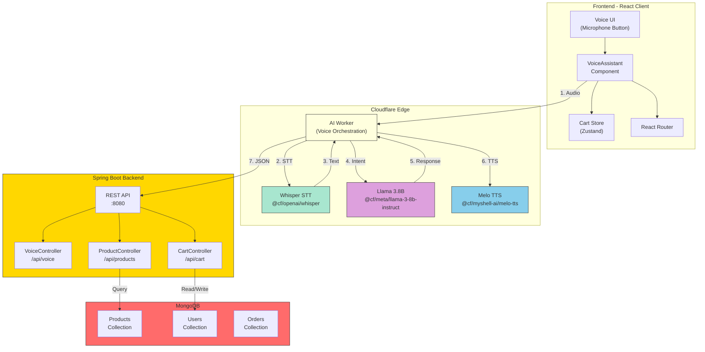
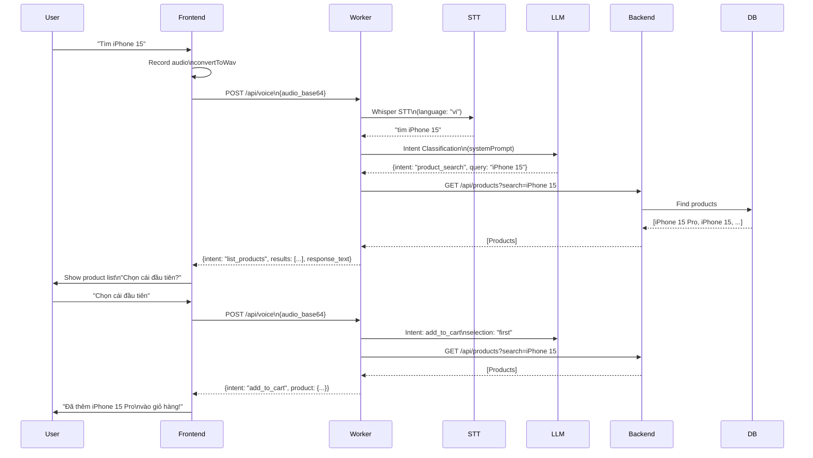
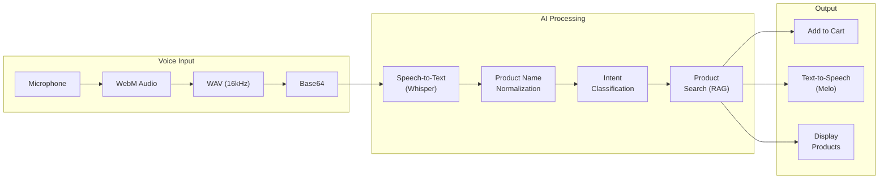
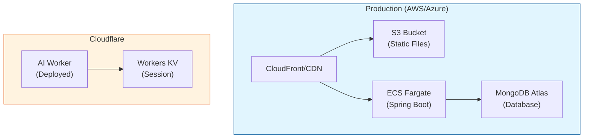

# Voice Commerce Architecture - TGDD

## System Architecture Diagram

## Voice Processing Flow

## Data Flow Diagram

## Component Details

| Component | Technology | Purpose |
|-----------|------------|---------|
| Frontend | React + Vite | Voice UI, cart management |
| Worker | Cloudflare Workers | Voice orchestration, AI gateway |
| STT | Whisper (CF) | Vietnamese speech recognition |
| LLM | Llama 3.8B (CF) | Intent classification, response generation |
| TTS | MeloTTS (CF) | Vietnamese text-to-speech |
| Backend | Spring Boot | REST APIs, business logic |
| Database | MongoDB | Products, users, orders |

## Deployment Architecture

---

This diagram shows the complete voice commerce architecture for your TGDD project. You can use this for your RFP documentation (Section 7 - Architecture diagrams).
